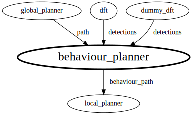

# behaviour_planner_pkg
A repository to store the behaviour planner 

# Table of Contents
1. [Workspaces](#Workspaces)
2. [Dependencies](#Dependencies)
3. [ROS2 Interactions](#ROS2-Interactions)
  1. [Interfaces](#Interfaces)
  2. [Launch Files](#Launch-Files)

# Workspaces
## fullstack_testing_ws
https://github.com/queens-autodrive/fullstack_testing_ws 
Behaviour planner for the stack.

# Dependencies

# ROS2 Interactions

## Interfaces

## Launch Files

## Node: behaviour_planner

### Publishers

#### autodrive_msgs/msg/Trajectory on /behaviour_path
Our speed limited path that we send to LP.
- https://github.com/local_planner_pkg: local_planner

### Subscriptions

#### autodrive_msgs/msg/Trajectory on /path
Our path we get from GP.
- https://github.com/global_planner_pkg: global_planner

#### autodrive_msgs/msg/Detection on /detections
Our environment from DFT
- https://github.com/dft_pkg: dft
- https://github.com/stimulation_pkg: dummy_dft

### Service Clients

### Service Servers

### Action Clients

### Action Servers

### Transform Broadcasters

### Transform Listeners
